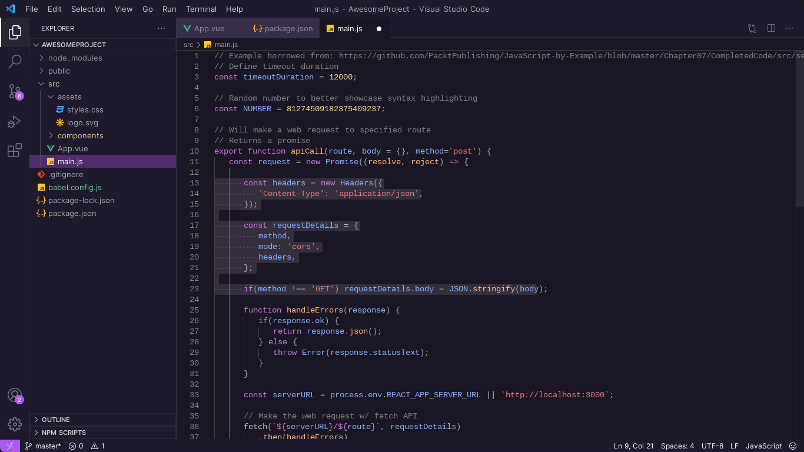

  

# Amethyst Theme for VS Code     

Scape from the borring 'Dark' & 'Light' theme with Amethyst Theme. A modern, dark purple theme for [VS Code](https://code.visualstudio.com/).

## How to install it

1. Open **Extensions** sidebar in your VS Code.
2. Search for **Amethyst Theme**.
3. Click **Install** to install the theme.
4. Click **Reload** to reload your editor.
5. Settings icon > Themes > Color Theme > **Amethyst Theme**.

##  Get it now

[<kbd>  <b> Get Extension </b>  </kbd>](https://marketplace.visualstudio.com/items?itemName=JuanILlaberia.amethyst-dark-theme)

[<kbd>  <b> Try it out </b>  </kbd>](https://vscode.dev/editor/theme/juanillaberia.amethyst-dark-theme/Amethyst)

[<kbd>  <b> Amethyst Theme web </b>  </kbd>](https://amethyst-theme.netlify.app/)

