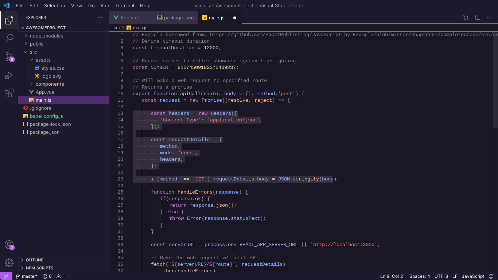

# Nebula for VS Code 🌌

A modern, dark purple theme for [VS Code](https://code.visualstudio.com/).

## How to install it

1. Open **Extensions** sidebar in your VS Code.
2. Search for **Nebula**.
3. Click **Install** to install the theme.
4. Click **Reload** to reload your editor.
5. Settings icon > Themes > Color Theme > **Nebula**.
